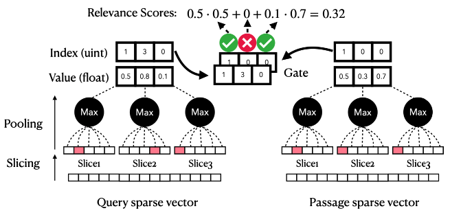

# Vectorizers

## TF-IDF & BM25

- `tfidf.py`

## DSRs (Densify Sparse Representations)

- `densify_sparse_representations.py`
- [Sheng-Chieh Lin and Jimmy Lin - Densifying Sparse Representations for Passage Retrieval by Representational Slicing (arXiv 2021)](https://arxiv.org/abs/2112.04666)

